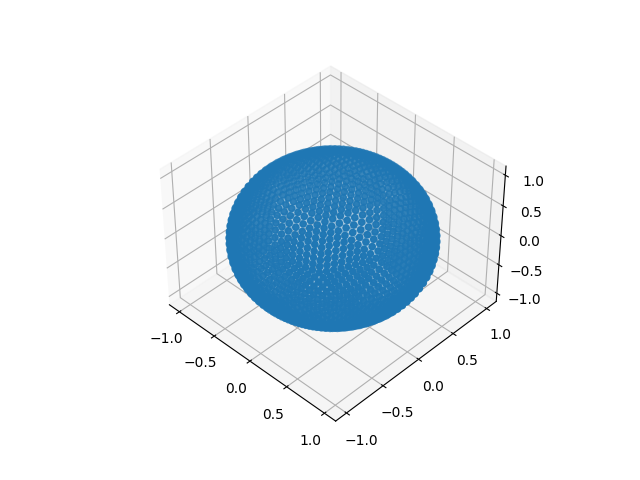

# Generate a sphere from a icosahedron

## Install

```
pip install requirements.txt
```

## Visualize sphere

To visualize the sphere with 4 levels of refining:

```
python view.py --file data/04.npy
```

Which produces the following results:

